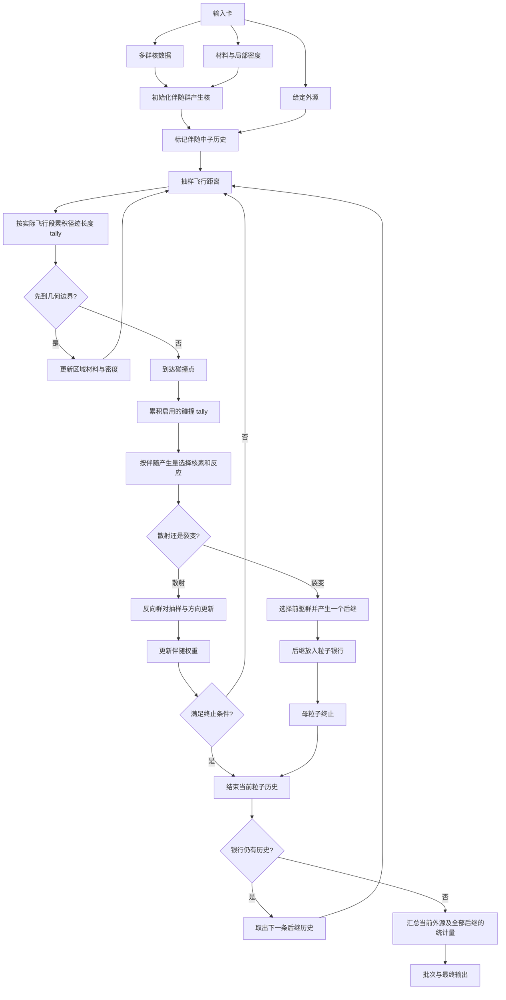
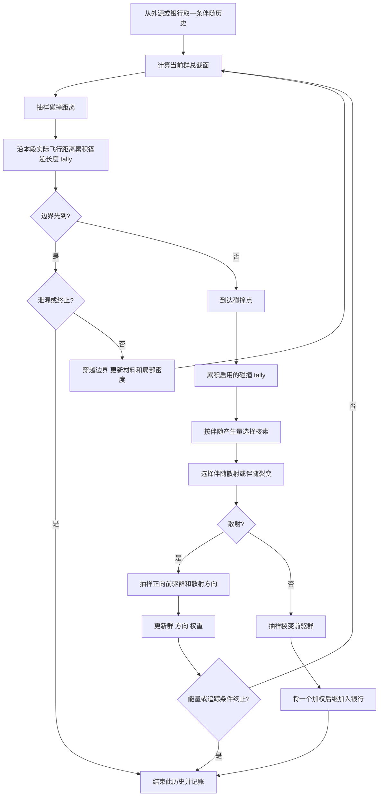
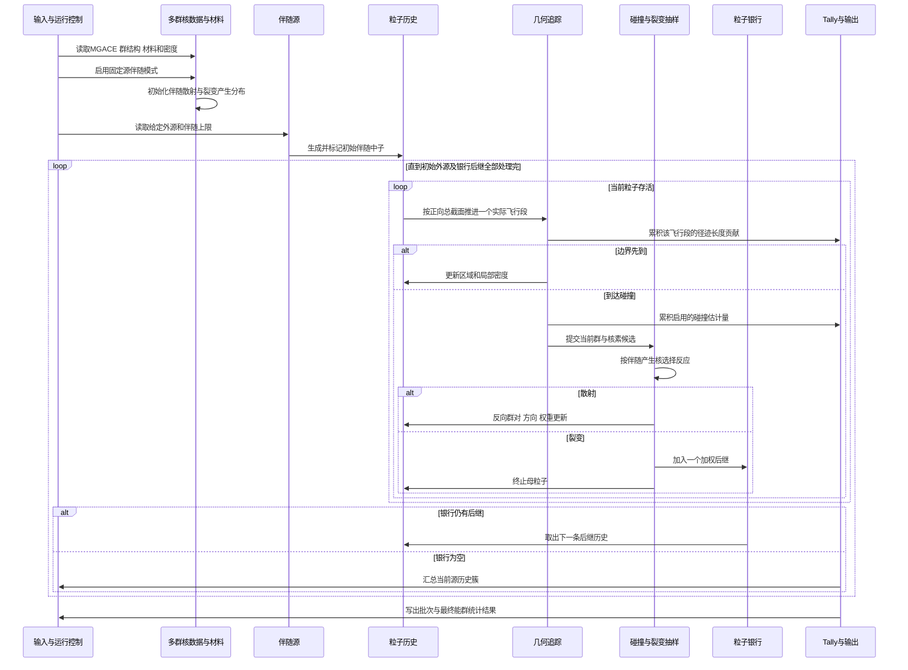
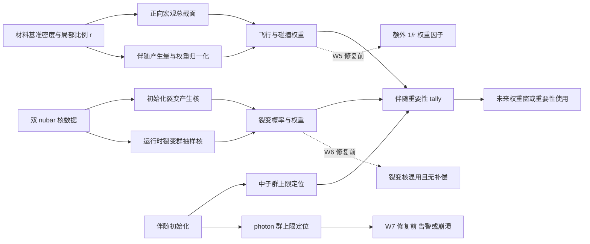
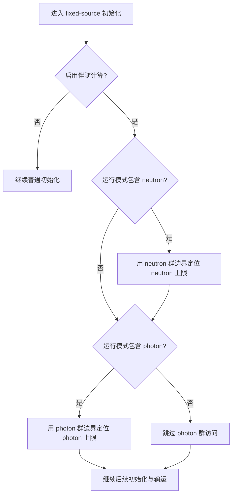
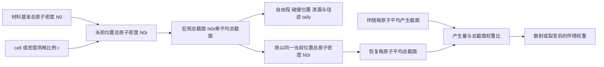

# 流程图与时序图

本页的图只描述当前 standard ACE、`ais=OFF`、MGACE fixed-source neutron adjoint 的实际组织方式。图中的“伴随源”是 RMC 接收的外源并标记为伴随历史；它不表示 F03 的响应驱动伴随源语义已经验证。

## 1. 功能总流程

**物理解读。** 核数据、材料组成和局部密度共同决定飞行与碰撞。初始化把正向群间产生关系整理为伴随抽样所需的量；运行时则反复执行飞行、逐段 tally、边界、碰撞和权重更新。裂变后继不会立刻与母粒子混在同一历史中，而是进入等待追踪的粒子银行。初始外源及其全部银行后继构成一个源历史簇；处理完整个历史簇后才进行历史级汇总，最终形成指定 tally 定义下的批次结果。

**边界。** 图只说明组织顺序，不代表每个环节都已通过物理验证；W5、W6、W7 的位置见第 4 图。

## 2. 单粒子历史

**物理解读。** 一条历史不是只在碰撞时发生变化：每段实际飞行都会产生径迹长度贡献，边界可先于碰撞并使局部材料与密度改变；真正到达碰撞点后还可产生碰撞估计量。散射把当前伴随群映射到正向会产生该群的前驱群；裂变则终止母历史，同时留下可继续追踪的后继。吸收不产生伴随后继，而是通过总截面损失项和权重比进入计算。泄漏、能量上限和裂变母粒子终止都会结束当前粒子历史。

## 3. 初始化与运行时序

**物理解读。** 最关键的分界是初始化与运行时：初始化预先建立群产生分布；运行时实际用这些分布选择反应、群和权重。W6 修复前这两阶段采用不同裂变核，当前已统一到 total nubar。tally 在飞行段和碰撞点即时计分，银行后继则在当前粒子终止后由外层调度继续追踪；粒子银行是裂变后继的延迟追踪机制，而不是额外的物理反应。

## 4. 缺陷定位与传播

**物理解读。**

- **W5** 位于局部密度进入飞行和权重比的连接处。修复前额外 $1/r$ 会污染碰撞后的重要性权重；当前工作树已让共同密度因子在产生量/总截面比中抵消，详见第 6 图。
- **W6** 位于“初始化建立的裂变核”与“运行时实际抽样的裂变核”之间。修复前两套核不同且没有补偿；当前两处都通过 total nubar locator 选择同一物理核，部署双表逐群概率差为 0。
- **W7** 位于伴随初始化、粒子类型与能群访问阶段。纯中子数据不应要求 photon 群；修复前的错误访问在数据碰巧带 photon 群时表现为无关告警，在没有 photon 群时可在输运开始前崩溃。当前工作树已改为按粒子模式分别定位 neutron/photon 上限，纯中子路径不再进入图中的错误分支。

这些修复不自动证明某个未运行 MLVR 算例正确；它们消除了已确认错误，但可裂变最终响应和更广泛问题仍需验证。

## 5. W7 修复后的初始化门控

**物理解读。** 两个粒子判断彼此独立：是否需要 neutron 群，只由本次模式是否包含 neutron 决定；是否需要 photon 群，也只由模式是否包含 photon 决定。纯中子路径经过 neutron 上限定位后，会明确走“跳过 photon 群访问”的分支，因此 photon 群不存在不再构成异常。耦合模式仍会依次定位两类上限，没有删去其原有初始化。

修复只改变能群结构的访问条件，不改变最大能量到群号的映射方法，也不改变截面、散射、裂变或权重公式。完整的判断表、修复边界和验证结果见[缺陷解读](04_三个已确认缺陷的物理解读.md#w7纯中子初始化却访问-photon-群)。

## 6. W5 修复后的密度数据流

**物理解读。** 局部比例 $r$ 没有从输运中删除：它仍通过宏观总截面改变平均自由程、碰撞位置、泄漏概率和径迹长度贡献。修复发生在权重归一化处，程序现在用同一个当前位置总原子密度 $N_0r$ 把宏观总截面还原为每原子平均总截面，因此碰撞权重不再额外携带 $1/r$。

这条修复同时用于伴随散射和伴随裂变权重。V2 动态测试直接覆盖散射并得到 $r=0.5,1,2$ 的权重比 $1:1:1$；后续等体积双区域测试又覆盖了跨密度界面的完整飞行—碰撞—tally 历史，在两种相反密度排列、两个群对的 1M 全量批次中通过逐种子、分组和总体互易性判据。W6 已另行统一裂变核，并用单一 `g6↔g1` 裂变主导最终响应案例完成五组独立流互易性检查。详细公式和验证结果见[缺陷解读](04_三个已确认缺陷的物理解读.md#w5局部密度没有在伴随权重比中抵消)。

## 技术证据

图中流程对应的主要实现位置见 [功能逻辑与物理对象](01_功能逻辑与物理对象.md)。W5/W6/W7/W9 的源码、核数据与运行证据边界见 [缺陷解读](04_三个已确认缺陷的物理解读.md)、[F02 数值验证](../../MLVR_develop/20260825_01_f02-adjoint-numerical-verification/README.md) 和 [W9 动态确认](../../MLVR_develop/20260825_11_f02-angular-density-asset-qualification/README.md)。
