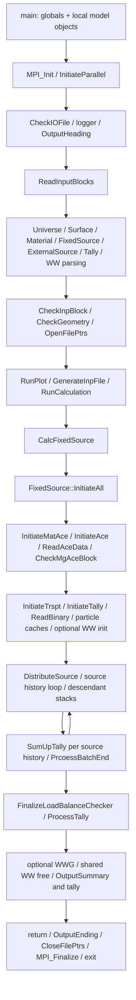
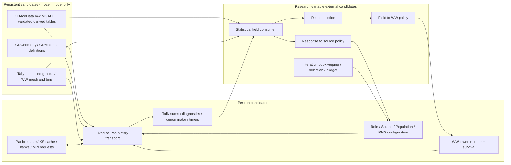

# RMC Runtime Architecture Audit — Codex

审查日期：2026-09-29。任务类型：C，独立源码审查；未运行输运、未实现接口。

证据标记：**[S]** 当前工作树源码事实；**[I]** 基于列出的源码作出的推断；**[U]** 静态审查不能确定。所有 `RMC/...:行号`、`AIMC_WWiteration/...:行号` 均相对工作区根目录。检索命令、带行号摘录及哈希见 [source-navigation.txt](logs/source-navigation.txt)。本报告没有采用历史 F02–F10 档案或 Claude 审查作为证据。

## 1. Executive summary

1. **[S] 当前正常入口是一次解析、一次模式分派、输出结束、退出。** `main` 在 MPI 初始化后读输入，调用一次 `RunCalculation`，最后关闭输出并 finalize。固定源分支只调用一次 `CalcFixedSource`。证据：`RMC/src/main.cpp:92`、`RMC/src/main.cpp:142`、`RMC/src/main.cpp:155`、`RMC/src/main.cpp:162`、`RMC/src/main.cpp:166`、`RMC/src/RunCalculation.cpp:83`。
2. **[I] 同进程连续固定源计算有可用内部构件，但当前入口不能直接重复调用得到独立 runs。** 已完成标志、累计 histories、bank、伴随标志及初始化副作用都跨调用存活；`InitiateAll` 同时做模型准备和每次计算准备。直接再次调用会先重新初始化，再因完成标志跳过主循环。证据：`RMC/src/CalcFixedSource.cpp:78`、`RMC/src/CalcFixedSource.cpp:107`、`RMC/src/InitialBatchSource.cpp:335`、`RMC/src/InitiateTrspt.cpp:60`。
3. **[S/I] F→A→F 不是现成的安全切换。** ACE 和粒子伴随标志存在仅置 true 路径；伴随能量上限被原地从 MeV 转为群号；伴随截面构造对保留数组执行 `+=`。这些是明确的状态边界问题，不是对伴随物理算法正确性的重新裁决。证据：`RMC/src/InitiateAll.cpp:130`、`RMC/src/InitiateAll.cpp:192`、`RMC/src/SampleNeutronSource.cpp:222`、`RMC/src/TreatAdjointMaterial.cpp:22`。
4. **[S/I] WW 数值更新、内存 Field 提取和完整物理能群边界有具体落点。** native WW 的 lower/upper/survival 存在独立数组；tally 已有 Ave/RE；MGACE 的 centre/width 可提供最高上界。三者尚不等于对外可调用、生命周期完整的 API。证据：`RMC/src/WeightWindows.cpp:79`、`RMC/src/OutputTally.cpp:247`、`RMC/src/CheckMgAceBlock.cpp:43`。
5. **[S] 当前 AIMC 工作树并非任务预期的 develop。** 实际为 `feature/3d-two-group`；所查主流程使用本地 Numba MC，未发现 RMC 启动、输入生成或 `.Tally` 读取链。此结论仅适用于本次实际 revision 和检索范围，见 §14。
6. **[U] 没有足够性能证据决定是否值得保留长生命周期执行。** FixedSource timer 覆盖初始化至最终输出，不能当纯 transport 时间。未执行计时实验，未据文件读取路径宣称“开销很大”。见 §4。

结论边界：本报告列出能力、障碍及最小验证问题，不选择 F11 架构。

## 2. Repository / revision

| 仓库 | 实际 branch | HEAD | 开始状态 |
|---|---|---|---|
| RMC | `Neural_Network_WW_Iteration` | `5cfb0f771d0c5a2127c90d57e51ce672a4e3b616` | clean |
| AIMC_WWiteration | `feature/3d-two-group` | `9d749291d5f5070a00b9f88603428e686938cb7f` | 仅已有未跟踪 `article/成都会议/成都会议论文投稿版.pdf` |

原始 `branch / rev-parse / status / log -10` 输出见 [开始快照](logs/repository-state-start.txt)，收尾复核见 [结束快照](logs/repository-state-end.txt)。未切分支，未读取或处理该 PDF。没有把 develop 的内容推定为当前内容。

独立性：开工按工作区约定读过 STATUS、AGENT_CONTEXT，并已有本会话的 F10 背景；这些没有用作源码结论证据。[source-only preliminary](logs/preliminary-source-only-conclusion.md) 已先行完成，此后也未读历史 F02–F10 档案或 Claude 任务目录。

主查范围为普通 MG neutron fixed-source、native track-mesh WW、mesh tally。对 MPI、restart、burnup、临界、动力学作生命周期抽查；未覆盖所有 CE、AIS、耦合粒子、几何变形及扩展编译组合。

## 3. RMC process lifecycle

### 3.1 实际调用链 [S]

对应入口：`RMC/src/main.cpp:57`、`RMC/src/main.cpp:124`、`RMC/src/main.cpp:142`、`RMC/src/main.cpp:148`、`RMC/src/main.cpp:155`；解析和检查：`RMC/src/ReadInputBlocks.cpp:57`、`RMC/src/ReadInputBlocks.cpp:377`、`RMC/src/CheckInpBlock.cpp:61`、`RMC/src/CheckInpBlock.cpp:99`；固定源：`RMC/src/CalcFixedSource.cpp:67`、`RMC/src/CalcFixedSource.cpp:199`、`RMC/src/CalcFixedSource.cpp:719`；输出：`RMC/src/OutputSummary.cpp:186`、`RMC/src/OutputEnding.cpp:82`。

注意顺序：source 定义及分布检查在解析时完成；native WW 数值也在解析时构造。图中的 optional WW init 是 WWG/MCNP 分支，不代表 native WW 到输运前才首次读入。证据：`RMC/src/ReadExternalSourceBlock.cpp:87`、`RMC/src/ReadWeightWindow.cpp:419`、`RMC/src/InitiateAll.cpp:177`。

### 3.2 所有权决定可取数位置 [S/I]

| 对象 | 实际持有者与存活期 | 对未来调用边界的影响 |
|---|---|---|
| Geometry、Material、Tally、ParticleState、NeutronTransport 等 | main 创建；`RunCalculation` **按值**接收它们 | 当前运行使用函数内副本；不能假定返回 main 后 `OTally` 就含最终 Field |
| AceData、FixedSource、RNG | main 创建；`RunCalculation` 按引用接收 | 返回后保留变更；重新进入分派不等于重置 |
| ExternalSource | main 持有，分派按引用；`CalcFixedSource` 再按值接收 | 运行内 source 改动不自动写回上层定义 |
| WW、CalMode、Output、Timer、Status、PTRAC、MPI | 全局 | 不能靠销毁一个 fixed-source 局部对象消除全部状态 |

证据：`RMC/src/main.cpp:27`、`RMC/src/main.cpp:60`、`RMC/src/RunCalculation.cpp:6`、`RMC/src/CalcFixedSource.cpp:67`。这里“按值”不保证所有嵌套资源深拷贝；tally raw-pointer registry 等仍须另查别名关系。AceData 本身的复制构造直接抛异常：`RMC/src/AceData.h:99`。

## 4. Initialization/data lifetime

### 4.1 模型与数据 [S/I]

| 阶段 | 建立位置与存储 | 可复用条件 / 当前耦合 |
|---|---|---|
| 几何定义 | Universe/Surface 解析；`CDGeometry::p_vCell/p_vSurface/p_vUniverse`；`CheckGeometry` 关联材料/空间/用户编号 | 固定几何有长期保存基础；每 history 位置、层级、距离等在 ParticleState。不能把整个 Geometry 宣称不可变：还含输出面源、特殊随机几何等状态 |
| 材料定义与核素映射 | 解析后 `GenTotNucIdList → InitiateAce → ConvertMatNucIndex → ConvertMatNucDen` | composition、density、temperature、采样配置不变才有复用前提；当前与数据加载合在 `InitiateMatAce` |
| XSDIR / ACE / MGACE | `ReadAceData` 打开 xsdir 和 ACE；核素内容保存在 `CDAceData::p_vNuclides` 的 NXS/JXS/XSS；MG 派生表也归 AceData | AceData 由 main 持有；并非每 history 读取。但每次 `CalcFixedSource → InitiateAll` 又进入加载路径 |
| 伴随核数据派生量 | 同一 AceData / Nuclide 内的 adjoint cross sections | 原始 MG 数据共享；伴随缓存具有另一个初始化阶段，不是另一套文件数据库 |
| tally / WW mesh | 各自 `CDMesh` 定义；统计 storage 与 lower-bound 数组分开 | 固定 mesh/group definition 可作为保留候选；保持定义不变仍需清每轮统计状态 |

证据：`RMC/src/ReadInputBlocks.cpp:57`、`RMC/src/ReadInputBlocks.cpp:76`、`RMC/src/Geometry.h:1227`、`RMC/src/CheckGeometry.cpp:25`、`RMC/src/InitiateMatAce.cpp:11`、`RMC/src/InitiateMatAce.cpp:18`、`RMC/src/InitiateMatAce.cpp:63`、`RMC/src/ReadAceData.cpp:83`、`RMC/src/ReadAceData.cpp:427`、`RMC/src/ReadAceData.cpp:1029`、`RMC/src/AceData.h:1650`。

**[I] 可复用的是冻结模型下的数据内容，不是“原样反复调用整套初始化”。** `InitiateMatAce` 还调用 `VaryMat/VarySurf`、初始化 cell 密度/温度、输出材料文件；`InitiateAce` 的同尺寸 `resize` 不清除已有 nuclide 对象。证据：`RMC/src/InitiateMatAce.cpp:69`、`RMC/src/InitiateMatAce.cpp:74`、`RMC/src/InitiateAndClear.cpp:44`。本次未证明所有特殊几何模式都满足跨 run 不变条件。

### 4.2 Performance evidence：计时器实际口径 [S/U]

| 已有 timer / 输出 | 实际范围 | 能否单独量化阶段 |
|---|---|---|
| Total | OutputHeading 启动至 OutputEnding；包括读卡和整个计算；不含更早的进程创建/MPI_Init | 不是完整外部 wall time；停止时间判断及统计 FOM 也引用它 |
| ReadInputBlock | 读卡开始至 CheckInpBlock、DFSurf、cell flux 预处理后 | 可以量这个组合，不能单独分离 geometry |
| Initialize | 所查 `InitiateAll` 中只在临界重载计时 | 不能把临界 initialization 输出当普通固定源 XS load 时间 |
| FixedSource | `CalcFixedSource` 进入、初始化前 start；ProcessTally、WWG、摘要输出后 stop | 包含 XS/data load + 初始化 + 输运 + 末处理；不是纯 transport |
| Tally | `TallyByTL` 调用范围内 start/stop | 标签虽叫 Tally Process，不能当最终 `ProcessTally` 的单独计时 |
| XS / MGACE load、最终 MPI reduce / normalization | 所查路径没有独立完整 timer | 当前没有足够证据给出耗时或占比 |

证据：`RMC/src/OutputHeading.cpp:12`、`RMC/src/OutputHeading.cpp:29`、`RMC/src/OutputEnding.cpp:46`、`RMC/src/ReadInputBlocks.cpp:16`、`RMC/src/ReadInputBlocks.cpp:384`、`RMC/src/InitiateAll.cpp:18`、`RMC/src/InitiateAll.cpp:116`、`RMC/src/CalcFixedSource.cpp:73`、`RMC/src/CalcFixedSource.cpp:749`、`RMC/src/TallyByTL.cpp:30`、`RMC/src/TallyByTL.cpp:101`、`RMC/src/OutputTimer.cpp:29`、`RMC/src/StatisticsFunc.cpp:124`。

未采集实际算例 timing，也没有利用历史输出推算加速比。未来最小测量应分开：外部启动/MPI、读卡/几何、xsdir/ACE 读取、MG/伴随派生、tally/bank 准备、纯 history loop、最终归约/均值 RE、输出；同时记录 rank、数据库页缓存冷/热条件、配置和重复次数。该测量未执行。

## 5. Fixed-source runtime lifecycle

**[S] population 不是编译期常量。** 输入写入 `p_llUserInputParNum`；`CheckFixedSource` 从它生成 input/time interval；运行时 `CalcParticleInterval` 再结合已完成 histories、restart 和停止时间计算剩余额度。证据：`RMC/src/ReadFixedSourceBlock.cpp:54`、`RMC/src/CheckTransport.cpp:51`、`RMC/src/InitialBatchSource.cpp:94`。**[I]** 可每轮改，但不能只赋这个字段而保留完成计数、interval、RNG 位置和统计诊断大小。

**[S] neutron 主循环**：push 一个 sentinel bank → `while(finish < 2)` → `DistributeSource` → 遍历本 rank 的 source histories → 设置 RNG stride → `SampleFixSource` → transport 原粒子及所有 descendants → family 完成后一次 `SumUpTally` → batch end。证据：`RMC/src/CalcFixedSource.cpp:106`、`RMC/src/CalcFixedSource.cpp:119`、`RMC/src/CalcFixedSource.cpp:131`、`RMC/src/CalcFixedSource.cpp:167`、`RMC/src/CalcFixedSource.cpp:199`、`RMC/src/CalcFixedSource.cpp:207`。

**[S] bank 的含义和存活期**：`CDFixedSource` 的四类粒子栈存活于对象生命周期；WW splitting/fission 后代沿同一源 history 消耗。正常 history 终点只要求 neutron 栈退至 sentinel，不是销毁 FixedSource；再次进入函数还会 push sentinel。另有 `p_vFixedSrc` 和耦合粒子 bank。证据：`RMC/src/FixedSource.h:213`、`RMC/src/FixedSource.h:287`、`RMC/src/CalcFixedSource.cpp:107`、`RMC/src/CalcFixedSource.cpp:167`、`RMC/src/InitiateTrspt.cpp:98`。

**[S] 已有初始化只局部清理**：`InitiateTrspt` 清 fixedSrcCount、collision、missed count，并 resize bank；未把 finish、batch、已完成 histories 恢复到构造初值。构造初值见 `RMC/src/FixedSource.h:192`，部分初始化见 `RMC/src/InitiateTrspt.cpp:77`，完成时 finish=5 见 `RMC/src/InitialBatchSource.cpp:335`。`ResetTrspt.cpp` 中固定源 reset 仅为注释：`RMC/src/ResetTrspt.cpp:24`。

**[I] 再调用结论分两层**：

- 直接再次调用 `CalcFixedSource`、保留同一组对象：会重复全初始化，却没有完整 fresh-run reset，不能视作独立第二轮。
- 再次调用 `RunCalculation`：一些对象获得新按值副本，但 FixedSource、AceData、全局 WW/Output/Timer 仍延续；也不能据此消除阻塞。证据：`RMC/src/RunCalculation.cpp:6`。

一次结束后，传入 CalcFixedSource 的对象仍存在于调用者；tally mean/RE 已处理。回到 main 后，RunCalculation 的局部副本已结束；共享 WW window（若开启）已释放，Python source interpreter（若开启）已 finalize。证据：`RMC/src/CalcFixedSource.cpp:721`、`RMC/src/CalcFixedSource.cpp:735`、`RMC/src/CalcFixedSource.cpp:743`。

## 6. Forward/Adjoint switching

### 6.1 实际传播路径 [S]

| 层 | 状态及操作 | 证据 |
|---|---|---|
| input | FIXEDSOURCE ADJOINT 置 `p_bIsAdjoint=true`，保存最大伴随能量 | `RMC/src/ReadFixedSourceBlock.cpp:228` |
| model preparation | 若 FixedSource adjoint，置 AceData adjoint=true；MG 情形调用 `treatAdjointMaterial` | `RMC/src/InitiateAll.cpp:130`、`RMC/src/InitiateMatAce.cpp:65` |
| source/particle | 仍由普通 ExternalSource 抽样；依据 AceData/FixedSource 标志将粒子设为伴随 | `RMC/src/SampleNeutronSource.cpp:191`、`RMC/src/SampleNeutronSource.cpp:222`、`RMC/src/SampleNeutronSource.cpp:304` |
| XS/cache | 每核素伴随总/裂变截面；粒子内材料加权累积截面 | `RMC/src/TreatAdjointMaterial.cpp:22`、`RMC/src/SampleFreeFlyDist.cpp:85` |
| collision | 根据 particle adjoint flag 选择核素、反应和伴随散射出射状态 | `RMC/src/SampleColliNuc.cpp:25`、`RMC/src/SampleColliType.cpp:157`、`RMC/src/GetExitState.cpp:166` |
| fission | particle adjoint 分支改变裂变处理/后代采样 | `RMC/src/GetExitState.cpp:169`、`RMC/src/GetFissionNeuState.cpp:570` |
| WW | 当前值表没有 F/A role 维度；查询 particle type、位置、物理能量，操作同一 bank/RNG | `RMC/src/WeightWindows.cpp:45`、`RMC/src/DoMeshWeightWindow.cpp:39` |
| tally | 同一 mesh tally score/mean/RE 路径；受已改变的粒子轨迹和权重影响 | `RMC/src/ScoreMeshTally.cpp:63`、`RMC/src/ProcessTally.cpp:389` |

**[I]** 同一模型和原始 MGACE 足以提供两类运行所需原始数据，单从数据依赖看没有“切 role 必須重新打开数据库文件”的要求；当前函数组织却会重新读库。未验证保留库时所有派生数据都正确失效。

### 6.2 F→A→F 的具体污染边界 [S/I]

| 状态 | 源码事实 | 下一 run 必须满足的状态条件（非实现方案） |
|---|---|---|
| FixedSource / AceData / Particle role | ACE 和 source sampling 的传播仅在 true 时赋值；particle 构造初值为 false | 三层 role 一致；A→F 不能只关 FixedSource 开关 |
| adjoint cutoff | `p_dMaxAdjointNeutronEnergy` 被 `LocateMgErgGrp` 的整数结果覆盖 | 物理输入能量与内部群索引须有可区分的状态；不能把上次群号当 MeV 再转换 |
| nuclide adjoint cache | resize 后对既有元素 `+=`；同尺寸 Nuclide resize 保留对象；已查加载链无该数组 clear | 重建必须从零开始，或明确复用已构造的版本；重复构造不能累计 |
| particle XS/cache | 材料伴随累积在计算 XS 时 assign zero；但不同 cache 的更新依赖 material/energy/temperature 条件 | role 变化需触发有效的 XS 更新；不能仅保留“当前位置/能量未变”的缓存命中条件 |
| source / WW / tally | 这三者没有一套原生 F/A 双槽会随 role 自动换入 | 新 run 使用哪个源、哪张 WW、统计是否独立须外部明确；并确保之前 history 已结束 |

证据：`RMC/src/ParticleState.h:529`、`RMC/src/InitiateAll.cpp:130`、`RMC/src/InitiateAll.cpp:196`、`RMC/src/TreatAdjointMaterial.cpp:46`、`RMC/src/TreatAdjointMaterial.cpp:56`、`RMC/src/InitiateAndClear.cpp:44`、`RMC/src/SampleFreeFlyDist.cpp:85`、`RMC/src/CalcFixedSource.cpp:81`。Nuclide cache 的重复累加是确定的非幂等性质；它对某个特定重复调用算例的数值影响尚未动态测量。

## 7. Source lifecycle

**[S] 定义到抽样**：`ReadExternalSourceBlock` 创建 `CDSource` / 分布 / transform，`SetDistriMap`、`AddSource`；随后 `CheckSourceAndDistri` 归一化 fraction/bias fraction、解析子分布、绑定分布和几何变换、检查几何相关参数；运行时 `SampleSourceParticle` 选择源并调用其采样器。证据：`RMC/src/ReadExternalSourceBlock.cpp:30`、`RMC/src/ReadExternalSourceBlock.cpp:44`、`RMC/src/ReadExternalSourceBlock.cpp:65`、`RMC/src/ReadExternalSourceBlock.cpp:87`、`RMC/src/CheckSourceAndDistri.cpp:8`、`RMC/src/ExternalSource.cpp:46`。

| 问题 | 源码结论 |
|---|---|
| 只能在 parser 中建立吗？ | **[S/I]** `AddSource`、分布数组和检查函数是 C++ 对象操作，不依赖重读整份 input；但现有主调用者是 parser，没有完整 replace-source 对外入口 |
| Forward source 可复用吗？ | **[I]** 固定几何、同一源类型/分布下，已检查的定义可保留；采样粒子和本轮 source/bank counters 应独立 |
| Adjoint source 可替换吗？ | **[I]** 当前已支持的源类型可重建一组定义/分布并检查。`AddSource` 是追加，不是替换；子分布检查也有追加行为，不能反复对旧对象调用就视为 replace |
| 要重载几何/XS 吗？ | **[S/I]** `CheckSourceAndDistri` 的模型参数是 Geometry，未在该路径加载材料/XS；仅更新已有源族的概率或位置不显示读库依赖。新增 source 表示法、耦合裂变源、Python、surface source 是额外范围 |
| population 能单改吗？ | **[S/I]** 可改 scalar；需重新一致化 interval、history/restart、统计测试规模，见 §5 |

证据：`RMC/src/ExternalSource.cpp:15`、`RMC/src/CheckSourceAndDistri.cpp:25`、`RMC/src/CheckSourceAndDistri.cpp:59`、`RMC/src/ExternalSource.h:44`、`RMC/src/CheckTransport.cpp:51`、`RMC/src/SetStatisticsIndex.cpp:42`。

### RNG [S/I]

输入卡使用 `ResetRNGType/SetSeed0/SetStride`；包装类也有 `SetSeed/SetPosition/SetPositionPre`。source histories 通过 `GetRandSeed` 选各自 stride，MPI 分配、restart 会改位置。证据：`RMC/src/ReadFixedSourceBlock.cpp:145`、`RMC/src/RNG/RNG.h:446`、`RMC/src/RNG/RNG.h:506`、`RMC/src/RNG/RNG.h:525`、`RMC/src/RNG/RNG.h:544`、`RMC/src/CalcFixedSource.cpp:119`、`RMC/src/InitiateAll.cpp:158`。

LCG63_0 的 skip 参数/初始 seed 是函数内 **static**，只有 `POSITION_PRE != POSITION-1` 才重算；LCG64/128 也有 static 工作状态。仅改 seed0 或 stride、继续旧 position 可能走旧缓存路径。证据：`RMC/src/RNG/StrideRNG.cpp:85`、`RMC/src/RNG/StrideRNG.cpp:139`、`RMC/src/RNG/StrideRNG.cpp:190`。**[I]** 每轮完整 RNG 配置/位置重置有小范围落点，但多个实例交错、OpenMP 并发和跨 rank 可复现性不能据 setter 存在而宣布已支持。

稳定候选：已检查 source definition、distribution、transform、几何绑定。每轮候选：源策略输入、抽样权重、population、seed/stride/position、bank、histories 和归一化分母。

## 8. WW lifecycle

### 8.1 native track-mesh 的真实落点 [S]

| 内容 | 存储 / 调用位置 |
|---|---|
| 空间 mesh | 全局 `OWeightWindow.p_OWeightWindowMesh`，由 `ReadWeightWindowMeshBlock` 解析 |
| 能量 bin | `p_vEnergyBins[particleType]`；native reader 最后追加 `INFINITY_ENERGY` 作为末端哨兵 |
| lower / upper / survival | `p_vMeshInformation[particleType][meshIndex][energyIndex]` |
| native 数值构造 | `ProcessWeightWindow` 检查 mesh×energy 数量，赋 lower，并由 WUPN/WSURVN 生成 upper/survival |
| track lookup | `CalcUniversalMeshTrack` 划分轨迹；每段查 mesh 和物理能量；执行 splitting/roulette，然后对该段计 tally |
| 内部反向群号处理 | native `GetWeightWindowEnergy` 调 `AceData.GetErgValue`；MCNP 路径另行处理 |

证据：`RMC/src/ReadWeightWindow.cpp:431`、`RMC/src/ReadWeightWindow.cpp:419`、`RMC/src/WeightWindow.h:234`、`RMC/src/WeightWindows.cpp:45`、`RMC/src/WeightWindows.cpp:72`、`RMC/src/WeightWindows.cpp:79`、`RMC/src/DoMeshWeightWindow.cpp:21`、`RMC/src/TrackWithWeightWindow.cpp:12`。

### 8.2 运行间更新的边界 [I]

固定 mesh、particle type、energy bins 和 WWP 语义时，新的 lower 值可以写入现有表，或者经已有 `ProcessWeightWindow` 重新生成参数。该函数不解析 input，不读取 XS。**需要同步 upper 和 survival**；只改 lower 会留下不一致的旧派生值。

WW_A(k)→Adjoint 和 WW_F(k)→Forward 在查表层使用同一个容器，没有 role 双缓存。运行间可保持 geometry/material/MGACE、WW mesh、tally mesh 不变，前提是新表严格匹配现有定义；role、source、tally reset 仍是独立责任。更新必须处于旧 history/bank 已结束的边界；当前路径操作 particle weight、RNG 和 descendants，不能把输运中替换视为同一问题。证据：`RMC/src/WeightWindows.cpp:94`、`RMC/src/WeightWindows.cpp:103`、`RMC/src/DoMeshWeightWindow.cpp:39`。

**[S/I] MPI 条件分支必须单列**：shared WW 查询读取 `SharedMemoryPosition`，普通数组赋值不会自动同步该内存。shared flag 在 MCNP reader 设置，默认 false；native track-mesh 不应被错误描述成必走共享 window。共享模式的 window 创建、填充、fence 在 `InitiateWeightWindow`，fixed-source 结束时 free。证据：`RMC/src/WeightWindow.h:64`、`RMC/src/ReadMCNPWeightWindowCard.cpp:307`、`RMC/src/WeightWindows.cpp:54`、`RMC/src/WeightWindows.cpp:268`、`RMC/src/CalcFixedSource.cpp:737`。

WW energy 末端哨兵不是 MGACE 真实最高能群上界；不能把它当 Field 的 physical G+1 boundaries。

## 9. Tally/Field lifecycle

### 9.1 定义、累计和归一化 [S]

1. Mesh 定义在 parser 建立；`SetupMeshTally` 将 `Energy=-1` 替换为 MG 下界向量，并计算 `mesh_count × (G+1)` 存储长度。这里额外的 `+1` 是 **Tot tally**，不是 G+1 能量边界。证据：`RMC/src/SingleTally.cpp:875`。
2. `InitiateTally` 清/分配 storage，登记 tally data 指针并 SetZero。storage 为 `p_vScore/p_vScoreTemp/p_vSum1/p_vSum2/p_vAve/p_vRe`；定义与 storage 分离。证据：`RMC/src/InitiateTally.cpp:60`、`RMC/src/SetupCellTallyData.cpp:27`、`RMC/src/TallyData.cpp:8`。
3. Type=1 track-length score 基于粒子权重×网格内轨迹。mesh `NORMALIZE=1` 的体积除法已发生在网格轨迹计算阶段，随后才累计 score，**不是输出时才除体积**。证据：`RMC/src/ReadMeshTallyCard.cpp:257`、`RMC/src/MeshFun.cpp:479`、`RMC/src/MeshFun.cpp:611`、`RMC/src/ScoreMeshTally.cpp:63`、`RMC/src/ScoreMeshTally.cpp:85`。
4. 原始 source history 的全部 descendants 完成后一次 `SumTallyBin`：sum1 += score，sum2 += score²，score 清零；`p_setScoreIndex` 清空。证据：`RMC/src/CalcFixedSource.cpp:167`、`RMC/src/CalcFixedSource.cpp:199`、`RMC/src/TallyData.cpp:43`。不能把 WW 分裂后的各粒子当独立 RE 样本。
5. 末端 MPI `GatherHstryTally` 后，master 计算 mean/RE；`dM = p_dTotStartWgt`，`dDiv=1`。证据：`RMC/src/ProcessTally.cpp:330`、`RMC/src/ProcessTally.cpp:364`、`RMC/src/ProcessTally.cpp:389`。

### 9.2 Field 可以在内存取出 [S/I]

`p_OMeshTallyData.p_vAve`、`p_vRe` 就是文本输出使用的数组；`OutputMeshTally` 把它们的指针交给 `CDMeshTally::output`。输出只负责该表的排版/精度，取得 value/RE 不要求先生成 `.Tally`。证据：`RMC/src/OutputTally.cpp:247`、`RMC/src/OutputTally.cpp:259`、`RMC/src/SingleTally.cpp:981`。

可提取时间：有效 owner 内、所有 histories 和 MPI 归约/CalcAveRe 完成后、storage 下一次 reset 或 owner 结束前。内存导出还须携带 mesh、bin layout、role、实际 histories、归一化分母及其定义、完整 physical energy boundaries、tally type/estimator/volume-normalization 信息。取每群值使用 `GetMeshErgPtr`，排除 Tot；不能盲拷数组再猜轴。证据：`RMC/src/SingleTally.cpp:893`、`RMC/src/SingleTally.cpp:897`、`RMC/src/RunCalculation.cpp:10`。

**归一化的源码边界**：普通源在 batch end 把 `p_dTotStartWgt` 赋为累计 source histories；surface source 另有修正，自发裂变还可能调整它。`ExternalSource` 的 source-bias 权重是 fraction/bias fraction。故 `p_dTotStartWgt` 是当前代码实际使用的 denominator，不能仅凭变量名断言它永远等于任意输入下实测的 starting-weight sum。证据：`RMC/src/InitialBatchSource.cpp:295`、`RMC/src/InitialBatchSource.cpp:301`、`RMC/src/InitialBatchSource.cpp:321`、`RMC/src/ExternalSource.cpp:56`。

**[I]** 对已确认的单位 starting-source weight、NORMALIZE=1、Type=1 track-length 情形，输出可解释为 source-normalized track-length flux density；长度单位 cm 时几何量纲为 cm⁻² per unit starting source weight。扩展到非单位源权重前须另外核验统计和归一化语义。本次只指出代码事实，没有修改 F10 契约，也没有生成 F10 status 或重建场对象。

### 9.3 保留 mesh 的 reset [S/I]

`SetZero()` 可保留数组大小及 mesh 定义，清六组数值数组；但它不清 sparse touched indices、统计诊断对象或 tally 指针登记。正常完成的 `SumTallyBin` 会清 touched set，不能据此保证中断后的对象也干净。`SetStatisticsIndex` 追加诊断索引，`ReSize` 会重置多项统计和按 population 调整批大小；它们不等于一个完整 session reset。证据：`RMC/src/TallyData.cpp:17`、`RMC/src/TallyData.cpp:43`、`RMC/src/SetStatisticsIndex.cpp:36`、`RMC/src/StatisticsFunc.cpp:8`。

重复 `InitiateTally` 会再次 `push_back` 指向同一 storage 的 pointer；在所查 `RMC/src` 中未检出该 registry 的 clear/erase。**[I]** 完整 reset 需覆盖 accumulators、touched indices、统计诊断、registry 唯一性及 MPI 缓冲状态；单纯为固定 mesh 的新轮归零不必重读 mesh。证据：`RMC/src/InitiateTally.cpp:69`、`RMC/src/InitiateTally.cpp:143`、`RMC/src/ProcessTally.cpp:353`。

## 10. MG energy-definition lifecycle

| 信息 | 当前内存位置 / 算法 [S] |
|---|---|
| group centre | Nuclide XSS 的 `LERG+i-1`；整理到 `p_vNeuMltCentErg[G-i]` |
| group width | Nuclide XSS 的 `LERG+G+i-1`；本路径局部变量 dErgWidth，无需依赖文本 |
| lower boundary | centre − width/2；升序保存在 `p_vNeuMltErgBins[G-i]`，只有 G 项 |
| upper boundary | centre + width/2；最高上界也可由 `2*centre[last]-lower[last]` 得到；现有 Locate 函数已使用该表达式 |
| reverse mapping | 内部 group g 对应物理升序数组索引 `G-g`；Locate 反向映射为 `G-index` |

证据：`RMC/src/CheckMgAceBlock.cpp:38`、`RMC/src/GetMgCs.cpp:231`、`RMC/src/GetMgCs.cpp:263`。中子/光子分别存表；本报告主要核查中子路径。

**[I] 能力成立**：对于有效、相邻连续的 MGACE 群结构，可以从 G 个升序 lower + 最高 upper 形成物理 G+1 boundaries，或者从 XSS 的 centre/width 检查后形成；不必依赖 `.Tally` 反推。当前没有所需的完整对外边界导出函数；这是小范围读取/校验能力。

**[S/U] 一致性边界**：现有跨核素检查比较 lower，未在该循环独立比较所有 width/upper 或检查相邻区间连续性。最高 upper 不能取 WW 的 INFINITY 哨兵。需验证有限性、严格顺序、相邻 upper/lower、核素间一致性，并固定能量单位。证据：`RMC/src/CheckMgAceBlock.cpp:52`、`RMC/src/ReadWeightWindow.cpp:422`。这里没有断言当前数据库不一致。

## 11. MPI/OpenMP lifecycle

**[S] 进程生命周期**：`MPI_Init` 和 `MPI_Finalize` 位于 main，两者包住模式执行；普通 fixed-source 内没有每 run 正常 finalize。rank/size 存全局 OParallel；CLI threads 在 MPI 下 broadcast 后存 `p_nThreads`。MPI datatype 在 `InitiateParallel` 创建；DomainDecomposition 另外 split communicator。证据：`RMC/src/main.cpp:92`、`RMC/src/main.cpp:166`、`RMC/src/InitiateParallel.cpp:20`、`RMC/src/InitiateParallel.cpp:74`、`RMC/src/CheckIOFile.cpp:124`、`RMC/src/DomainDecomposition.cpp:29`。

**[I] 一个 MPI job 容纳多个阶段与顶层 Init/Finalize 放置不构成固有冲突**；但当前还没有多 run 命令循环，不能因此宣布 repeated MPI transport 已支持。每轮必须有所有 ranks 一致的 source/WW/role/population，并完成相同 collective 次序。

**[S] run 资源**：TIME_REDUCE 的非阻塞归约使用 FixedSource request/flag；退出正常计算前已有 Wait 并归零 request/flag。共享 WW window（MCNP 条件路径）在初始化创建、run 尾部 free。证据：`RMC/src/CalcFixedSource.cpp:12`、`RMC/src/CalcFixedSource.cpp:57`、`RMC/src/WeightWindows.cpp:268`、`RMC/src/CalcFixedSource.cpp:737`。**[U]** 特殊 decomposition、异常退出后的 communicator/请求/缓冲完整释放尚未证明；不把这一分支风险强加到默认 native WW。

**[S/U] OpenMP**：实际 fixed-source 文件中未检出 parallel pragma；临界和 burnup 有 parallel history loops，mesh tally 有 atomic。不能因 `--threads` 选项存在就认定普通 fixed-source 已多线程，也不能靠 atomic 推定 touched-index set、RNG static cache 都线程安全。证据：`RMC/src/CalcFixedSource.cpp:113`、`RMC/src/CalcCriticality.cpp:117`、`RMC/src/CalcBurnup.cpp:131`、`RMC/src/ScoreMeshTally.cpp:98`、`RMC/src/ScoreMeshTally.cpp:103`。多线程 fixed-source 不在本报告已确认能力中。

## 12. Global/static state

完整所有者/生命周期/reset 表见 [source-state-map.md](logs/source-state-map.md)。关键结果：

- **[S] 进程全局**：Output、WW、Status、CalMode、Timer、cellVec、PTRAC、Controller，以及条件编译的 OParallel/OPythonInterface。main 还有一个局部 ORNG，遮蔽同名全局 ORNG。证据：`RMC/src/main.cpp:27`、`RMC/src/main.cpp:60`。
- **[S] 核数据路径配置也是全局**：`Data::DataBase::{indexFilesPath,DataPath,hdf5Directory,readHDF5}`；它们不是 XS 数组所有者。XS 内容归 AceData/Nuclide。证据：`RMC/src/Data/Data.cpp:14`、`RMC/src/AceData.h:1650`。
- **[S] RNG 存在函数静态可变缓存**；mesh 中搜索到的 SCOPE_INFINITE / ZERO_TRACK_LENGTH 是常量，应区别于需要 reset 的缓存。证据：`RMC/src/RNG/StrideRNG.cpp:85`、`RMC/src/MeshFun.cpp:7`。
- **[S] 输入/日志也存在一次性状态**：Universe reader 的 static `bIsUniv0Defined` 保留首次定义；`init_global_logger` 第二次调用会抛 logic_error。`CheckUsedMat` 的 static vector 只按首次材料数量构造，未在函数开头清零；PTRAC filter 也有静态对象。证据：`RMC/src/ReadUniverseBlock.cpp:12`、`RMC/src/ReadUniverseBlock.cpp:27`、`RMC/src/Utility/IO/Logger.cpp:63`、`RMC/src/CheckUsedMat.cpp:7`、`RMC/src/ReadParticleTrackBlock.cpp:54`。因此即使选择每轮重建局部模型，也不能原样重走整套 main/parser；这些与“同一冻结模型下继续输运”是不同边界。
- **[S/U] 扩展模块另有状态**：PhotonAtomicDataBase 有进程级 elements/index，并有重新加载前 free；burnup 的 CheckDepletionNuc 有 once flag。它们已列入状态表，但未完成相应多轮证明。证据：`RMC/src/Photon.cpp:547`、`RMC/src/CheckDepletionNuc.cpp:8`。
- **[S/I] Timer 并非新一次 start 就清零**：reg 使用 emplace，stop 累加 runTime；reset 不清 recordTime，第二次 interval 需要考虑上次记录。Total 还用于 stop-time 和统计 FOM。证据：`RMC/src/Utility/Timer.h:47`、`RMC/src/Utility/Timer.h:82`、`RMC/src/Utility/Timer.h:96`、`RMC/src/Utility/Timer.h:123`、`RMC/src/InitialBatchSource.cpp:109`。
- **[S/I] 输出句柄和计数跨 run 存活**；CloseFilePtrs 关闭多个 FILE*，所查路径没有随后置空。重复使用/重复关闭不可默认安全。日志器另有全局对象。证据：`RMC/src/CloseFilePtrs.cpp:28`、`RMC/src/CloseFilePtrs.cpp:34`、`RMC/src/Utility/IO/Logger.h:221`。

检索覆盖 `RMC/src` 的 static/extern、adjoint 标志和缓存写入、fixed-source 调用点、MPI/error 符号，并针对主路径核读。不是对每个编译开关和所有全局变量完成了可重入性证明。

## 13. Existing repeated-run patterns

| 模式 | 已有循环和重置事实 [S] | 能借鉴的边界 [I] |
|---|---|---|
| eigenvalue cycles / criticality search | 初始化一次后逐 cycle；ProcessCycleEnd 处理 tally、bank，再 ResetCriticality；外层 EndCriticality 控制搜索 | 证明进程可容纳多阶段；cycle tally 统计单位与固定源独立 runs 不同，不能替代 fixed reset |
| burnup / depletion | Init 后多步循环；RestBurnup 清部分 material、ClearData 清 Nuclides、重进 InitiateMatAce，重设临界统计并 InitiateTally | 是显式分阶段重建例子；不是“保持 MGACE 永不重读”的已实现模式 |
| sampling / perturbation | RunCalculation sampling 循环多次 CalcCriticality，MPI RNG 总位置有显式清零；fixed-source 末端有 perturbation 系数处理 | 不能把采样循环误称为已有重复固定源；也未证明循环内所有初始化天然幂等 |
| kinetics chains / time evolution | CalcBurstTime 每 chain InitiateFissChain 清 bank/时间拟合状态；整 chain 汇总后 SumUpTally，最后 ProcessTally | 状态重置有可参考的局部实现；粒子链统计单位与普通固定源不同 |
| restart | 固定源 ReadBinary 在 restart flag 下恢复计数/tally/RNG；未开则立即 return | 语义是续算旧统计，不是开始独立新轮 |
| repeated fixed-source | 在 `RMC/src` cpp 检索仅有定义与分派调用；ResetTrspt 的固定源片段为注释 | 未发现可直接复用的完整独立多 run pattern |

证据：`RMC/src/CalcCriticality.cpp:66`、`RMC/src/CalcCriticality.cpp:264`、`RMC/src/ProcessCycleEnd.cpp:33`、`RMC/src/ProcessCycleEnd.cpp:79`、`RMC/src/ResetTrspt.cpp:8`、`RMC/src/CalcBurnup.cpp:59`、`RMC/src/CalcBurnup.cpp:583`、`RMC/src/RestBurnup.cpp:69`、`RMC/src/RestBurnup.cpp:87`、`RMC/src/RestBurnup.cpp:113`、`RMC/src/RunCalculation.cpp:29`、`RMC/src/CalcFixedSource.cpp:723`、`RMC/src/CalcBurstTime.cpp:12`、`RMC/src/CalcBurstTime.cpp:104`、`RMC/src/InitiateNeutronBank.cpp:68`、`RMC/src/ReadBinarySrc.cpp:330`、`RMC/src/ResetTrspt.cpp:24`。

## 14. AIMC external workflow

**[S] 实际工作树的主链是 Python/Numba 研究原型。** `solver.py` 导入并直接调用 `run_adjoint_mc/run_forward_mc`；`mc.py` 包装函数进入 Numba batch kernel。不经过 RMC executable 或 `.Tally`。证据：`AIMC_WWiteration/src/solver.py:65`、`AIMC_WWiteration/src/solver.py:429`、`AIMC_WWiteration/src/solver.py:600`、`AIMC_WWiteration/src/mc.py:371`、`AIMC_WWiteration/src/mc.py:509`、`AIMC_WWiteration/src/mc.py:560`。

| 职责 | 当前承担情况 [S/I] | 源码 |
|---|---|---|
| subprocess launch | batch_run 启动 Python main.py；不能等同启动 RMC | `AIMC_WWiteration/scripts/batch_run.py:75`、`AIMC_WWiteration/scripts/batch_run.py:97` |
| RMC input / tally 文件 | 对 src/scripts 的 Python 文件检索未发现对应链；当前 MC 直接返回数组 | `AIMC_WWiteration/src/mc.py:462`、`AIMC_WWiteration/src/mc.py:516`；检索见 navigation |
| 双向 scheduling / iteration | solver 的 iteration loop，先 adjoint、后 forward；iteration 和 seed namespace 传入 MC | `AIMC_WWiteration/src/solver.py:410`、`AIMC_WWiteration/src/solver.py:429`、`AIMC_WWiteration/src/solver.py:600` |
| population / batches | config→MC arguments；wrapper 验证总 history 数可被 batches 整除 | `AIMC_WWiteration/src/config.py:87`、`AIMC_WWiteration/src/mc.py:485` |
| Reconstruction | accumulator→training data→train model→预测场的分支存在 | `AIMC_WWiteration/src/solver.py:448`、`AIMC_WWiteration/src/solver.py:495`、`AIMC_WWiteration/src/solver.py:530` |
| WW generation | 根据场生成下一次 forward / adjoint WW | `AIMC_WWiteration/src/solver.py:574`、`AIMC_WWiteration/src/solver.py:795` |
| best FOM / snapshots | 比较候选并保存 best WW 与 iteration；持有候选快照 | `AIMC_WWiteration/src/solver.py:669`、`AIMC_WWiteration/src/solver.py:688` |
| result/history | HDF5、per-iteration payload、manifest、配置与 seed 信息 | `AIMC_WWiteration/src/solver.py:194`、`AIMC_WWiteration/src/solver.py:837`、`AIMC_WWiteration/src/experiment.py:283` |

**[I] 研究策略候选**：重建方法、训练数据选择、历史是否累计、WW 生成/混合、source-response policy、best candidate 选择、每轮 population。**执行机制候选**：配置验证、调用 transport、组织结果目录/HDF5、记录 seed/iteration/manifest。该区分用于理解可变性，不指定这些职责必须部署在哪个进程。

负面结论的范围：检索 `AIMC_WWiteration/src` 与 `scripts` 下 Python 文件的 `subprocess/Popen/mpirun/.Tally/RMC/rmc` 并沿当前 solver→mc 主链核读；未审查其他分支，也未断言工作区其他工具不存在 RMC orchestration。

## 15. Feasibility matrix

分类是 **[I] 源码可行性判断**，不是动态验收：A 当前基本可复用；B 小范围封装/reset；C 明显生命周期拆分；D 当前结构不适合/风险高；E 证据不足。下面 B 项仍依赖整体 run 边界先成立；不累计成“只需几个 setter 就能 persistent”。

| # | 功能 | 分类 | 限定与关键证据 |
|---|---|---|---|
| 1 | geometry/material 一次加载、多轮复用 | C | 固定模型内容可保留，但 RunCalculation 按值、InitiateAll 混合 model/run 初始化；特殊几何未证明。`RMC/src/RunCalculation.cpp:6`、`RMC/src/InitiateMatAce.cpp:69` |
| 2 | MGACE database 一次加载、多轮复用 | C | 内容存在长期 AceData；需分离每次必进的读库与 role 派生处理。`RMC/src/InitiateAll.cpp:131`、`RMC/src/InitiateMatAce.cpp:27`、`RMC/src/TreatAdjointMaterial.cpp:22` |
| 3 | mesh/tally definition 一次建立 | B | 定义与数据分开；保留 owner、固定群结构并约束重复 registration。`RMC/src/SingleTally.cpp:875`、`RMC/src/InitiateTally.cpp:60` |
| 4 | tally accumulation 每轮 reset | B | SetZero 已有；还需 touched set、registry、statistics tester 一致化。`RMC/src/TallyData.cpp:17`、`RMC/src/SetStatisticsIndex.cpp:36` |
| 5 | particle population 每轮修改 | B | 重新派生 interval 和统计规模、清完成计数。`RMC/src/CheckTransport.cpp:51`、`RMC/src/InitialBatchSource.cpp:94` |
| 6 | RNG 每轮重新配置 | B | 已有 setters；需完整 position/cache 重置契约。只限顺序运行；多线程/实例交错为 U。`RMC/src/RNG/RNG.h:506`、`RMC/src/RNG/StrideRNG.cpp:90` |
| 7 | Forward source 每轮复用 | B | 已验证 source 定义可保留；bank/counters 属每轮。`RMC/src/ReadExternalSourceBlock.cpp:87`、`RMC/src/ExternalSource.cpp:46` |
| 8 | Adjoint source 每轮更新 | B | 限已有 CDSource/Distribution 可表达的输入；需替换而非追加并检查。任意 Field→source policy/新源族为 E。`RMC/src/ExternalSource.cpp:15`、`RMC/src/CheckSourceAndDistri.cpp:25` |
| 9 | WW values 每轮热更新 | B | 限运行间、固定 native mesh/group；同步三个参数和 ranks；shared MCNP 另议。`RMC/src/WeightWindows.cpp:79`、`RMC/src/WeightWindows.cpp:54` |
| 10 | Forward → Adjoint | C | 角色传播、伴随派生缓存、cutoff、粒子 XS cache 共同变化。`RMC/src/InitiateAll.cpp:130`、`RMC/src/TreatAdjointMaterial.cpp:22` |
| 11 | Adjoint → Forward | C | 仅关 FixedSource 不能清 ACE/particle latch；需明确完整反向切换边界。`RMC/src/SampleNeutronSource.cpp:222`、`RMC/src/InitiateAll.cpp:130` |
| 12 | same-process repeated fixed-source | C | finish/counters/bank + model/run init + global IO/timer ownership；当前直接重入不可用。`RMC/src/CalcFixedSource.cpp:107`、`RMC/src/InitialBatchSource.cpp:335` |
| 13 | same MPI process repeated runs | C | 顶层生命周期可容纳，但依赖 #12，且涉及 collective 顺序、共享资源重建；未动态验。`RMC/src/main.cpp:92`、`RMC/src/CalcFixedSource.cpp:57`、`RMC/src/CalcFixedSource.cpp:737` |
| 14 | Field value/RE 内存提取 | B | 数组已可读；需在正确 owner/master/归一化后提取并附 metadata。`RMC/src/ProcessTally.cpp:389`、`RMC/src/OutputTally.cpp:247` |
| 15 | physical G+1 boundaries 内存提取 | B | 原始 centre/width 已有；需物理顺序、连续性和完整性校验。`RMC/src/CheckMgAceBlock.cpp:43`、`RMC/src/GetMgCs.cpp:272` |

## 16. Integration seam map

以下是 **[I] 基于真实对象的候选边界图**，箭头表示数据依赖，不代表批准的进程/API/通信架构。

| seam | 当前具体位置 [S] | 需要明确的接口责任 [I] |
|---|---|---|
| process / session | main、RunCalculation、全局对象 | owner、MPI/IO 生命周期与失败范围；不能把 main 原样当每轮函数 |
| model / run initialization | `InitiateAll → InitiateMatAce / InitiateTrspt / InitiateTally` | 哪些数据保留、哪些重新派生、哪些必须 reset |
| role application | input flag→AceData→ParticleState→MG adjoint cache | 双向一致的角色和 cache 状态，物理能量与群号区分 |
| source and RNG preparation | ExternalSource Add/Check；RNG setters；DistributeSource | 替换/复用定义、history 数、seed namespace 和归一化口径 |
| WW replacement | ProcessWeightWindow / runtime lookup | 保持 mesh/group 契约，派生参数和 MPI 一致性，run 间更新 |
| execution | CalcFixedSource 中 DistributeSource→history loop→batch end | 完成条件、bank、rank collective、失败处理 |
| result extraction | ProcessTally 后、RunCalculation owner 结束前 | 数组有效期、master 归约、mesh/group metadata、实际 denominator |
| energy metadata | CheckMgAceBlock 后 AceData | 从完整库结构提供物理边界，校验而不是文本推测 |

证据落点：`RMC/src/RunCalculation.cpp:6`、`RMC/src/InitiateAll.cpp:125`、`RMC/src/ExternalSource.cpp:15`、`RMC/src/RNG/RNG.h:525`、`RMC/src/WeightWindows.cpp:79`、`RMC/src/CalcFixedSource.cpp:108`、`RMC/src/ProcessTally.cpp:389`、`RMC/src/CheckMgAceBlock.cpp:38`。研究变量的现有例子见 §14；Response→adjoint-source 的最终物理定义不由本图决定。

## 17. Confirmed blockers

这里的 blocker 指“把当前函数原样重复调用/当成完整 session”的阻塞，不代表未来无法重构。

| ID | 已确认事实 [S] | 对直接复用的后果 [I] |
|---|---|---|
| B1 | finish 正常完成后为 5；入口 while 要求 <2；InitiateTrspt 未复位 | 第二次 run 不会按 fresh-run 语义进入 history loop |
| B2 | role 只向 ACE/particle 传播 true；adjoint cutoff 原地转群号 | A→F 和重复初始化没有完整可逆状态协议 |
| B3 | adjoint cache resize+累加，保留同尺寸 Nuclide | 重复构造不幂等，不能作为无条件每轮 init |
| B4 | 每次 CalcFixedSource 都进入 MatAce/读库；RunCalculation 按值持有模型/tally | 不能用现有整函数同时保证“数据只加载一次”与“结果长期由 main 持有” |
| B5 | InitiateTally 追加 storage pointers / statistics indices | 反复初始化不是完整 reset；registry 唯一性不成立 |
| B6 | fatal 路径 exit / MPI_Abort，未返回 run failure 状态 | 本轮 fatal 后继续同一 session 无现成支持 |
| B7 | Universe 0 parser flag 为 static，logger 全局初始化有 once guard | 原样重复 main 初始化或完整重读 input 也不是可直接采用的替代入口；冻结模型保留不触发这些路径 |

证据：B1 `RMC/src/InitialBatchSource.cpp:335`、`RMC/src/CalcFixedSource.cpp:108`、`RMC/src/InitiateTrspt.cpp:77`；B2 `RMC/src/InitiateAll.cpp:130`、`RMC/src/InitiateAll.cpp:196`、`RMC/src/SampleNeutronSource.cpp:222`；B3 `RMC/src/TreatAdjointMaterial.cpp:22`、`RMC/src/TreatAdjointMaterial.cpp:46`、`RMC/src/InitiateAndClear.cpp:44`；B4 `RMC/src/InitiateMatAce.cpp:27`、`RMC/src/RunCalculation.cpp:6`；B5 `RMC/src/InitiateTally.cpp:69`、`RMC/src/SetStatisticsIndex.cpp:36`；B6 见下。

B7 证据：`RMC/src/ReadUniverseBlock.cpp:27`、`RMC/src/Utility/IO/Logger.cpp:63`。

### Error / cleanup path [S/I]

`PrintFile` 的 error 分支：非 master 有 `MPI_Finalize(); exit(0)`，master MPI 分支 `MPI_Abort`，普通路径 `exit(1)`。Logger::fatal 也直接 exit；部分 FileIO 直接 exit；AceData 复制构造可 throw，但 main 没有用于 run rollback 的 catch 边界。证据：`RMC/src/PrintFile.cpp:9`、`RMC/src/PrintFile.cpp:52`、`RMC/src/Utility/IO/Logger.h:164`、`RMC/src/FileIO.h:67`、`RMC/src/AceData.h:99`、`RMC/src/main.cpp:57`。

正常 cleanup 包括 load-balance request 完成、共享 WW free、条件 Python finalize、末端关闭输出、MPI_Finalize；这些不构成失败时的事务回滚。**[I] 当前默认是失败终止进程/job，不能承诺某轮 fatal 后恢复；非 master exit(0) 还表明仅凭单一进程退出码判断成功不足。** 本报告不实现异常恢复。

## 18. Risks

| 风险 [I] | 证据基础 [S] | 尚不能断言的部分 |
|---|---|---|
| 重用粒子保留错误 XS cache | `CalcFixedSource.cpp:82` 同尺寸 resize 不重置已有 dirty flag；XS 有条件更新 | 各个输入下是否实际命中错误缓存，需要序列实验 |
| RNG 多实例/重配污染 | `RNG/StrideRNG.cpp:85` static 跳步状态 | 所有 generator/线程组合是否复现不同序列 |
| tally 别名和统计诊断残留 | `RunCalculation.cpp:10` 按值，`InitiateTally.cpp:69` raw pointers，`SetStatisticsIndex.cpp:36` 追加 | 不同复制/重建顺序的完整风险范围 |
| timer 与 FOM 跨轮混用 | `Utility/Timer.h:59` 累计；`StatisticsFunc.cpp:124` Total | 实际偏差大小、所需 FOM 口径 |
| MPI shared WW 悬空数据/集体调用失配 | `CalcFixedSource.cpp:737` free；`WeightWindows.cpp:54` 查共享地址 | 条件资源重建和多节点正确性未测；默认 native 不走此分支 |
| 全局 IO/PTRAC/optional Python 状态泄漏 | `main.cpp:28`、`main.cpp:35`、`CalcFixedSource.cpp:743`、`CloseFilePtrs.cpp:28` | 单独保留各资源时的增长及模块重入能力 |
| source normalization 误标 | `InitialBatchSource.cpp:298`、`ExternalSource.cpp:56` | arbitrary source weight 的 denominator 与统计解释尚待明确 |
| 特殊模型破坏冻结假设 | `InitiateMatAce.cpp:69` VaryMat/VarySurf，粒子耦合另有 init | 没有对 CE、随机几何、耦合输运做复用证明 |
| MG boundaries 合法性校验不足 | `CheckMgAceBlock.cpp:52` 比较 lower | 当前库是否存在 width/upper 不一致；没有证据认定存在 |

本节短路径均在 `RMC/src/` 下；完整状态表提供全路径定位。

## 19. Unknowns + proposed experiments

全部 **[U]**，仅为后续最小验证建议；本任务未执行、未写 harness，也未修改参考结果。

| ID | 问题 | 最小后续实验 | 判定观测 |
|---|---|---|---|
| U1 | fresh-run reset 是否完整 | 一个小 MG neutron 固定模型，两次 F→F；与两个全新进程相同 seed/配置对照 | 实际 history、sum1/sum2、Ave/RE、bank 大小、finish/counters；先看是否真正执行第二轮 |
| U2 | role 双向切换是否正确 | 同一小模型 F→A→F，另做 A→A；各阶段与新进程对应 role 比较 | 三层 role、cutoff 的物理/内部值、adjoint cache 内容、粒子 XS、统计数组 |
| U3 | WW 只换值是否充分 | 固定 mesh/groups，WW1→WW2；第二轮与新进程 WW2 对比；先串行后两 ranks | lower/upper/survival 全表、实际查表值、histories 和输出；共享 MCNP 如纳入再单测 |
| U4 | tally 仅归零是否独立 | 保留定义重复两轮，同时开启一个 mesh tally 统计诊断 | registry/index 数量恒定，touched set 空，第二轮 sum1/sum2 无旧数据，metadata 正确 |
| U5 | RNG 重配是否可复现 | 各支持 RNG 类型按相同 seed/stride/position 重配；与新实例比较首几条 history 的 seeds；测试两个实例交错 | 精确 seed 序列及 position/preposition，而非只比较均值 |
| U6 | MPI job 多轮是否资源完整 | 两 ranks 执行 U1/U2；按启用范围增加 TIME_REDUCE/shared WW | collective 完成，request 已结束，无第二次 free/旧共享指针使用；不以串行结果代替 MPI 证明 |
| U7 | 内存 Field 与文件一致吗 | 一次正常小算例在归约后提取 arrays，和现有文本按输出精度比较 | mesh/group ordering、Tot 排除、NORMALIZE、value/RE、history/denominator；无需修改 reference |
| U8 | 内存完整群边界可靠性 | 读取同一有效 MGACE 的 centre/width，检查所有 nuclides、相邻边界和最高 upper | G+1 长度、单位、严格递增、连续性、物理↔内部群索引往返 |
| U9 | 任意源权重的归一化语义 | 先声明期望 denominator，再设计单位源、偏倚源、非单位源权重的最小对照 | 记录实际 starting weights、history 数、代码 denominator、raw sums；验证估计量和 RE 解释 |
| U10 | 复用的收益及资源增长 | 阶段计时的冷/热启动与若干相同模型运行；另观察多轮 RSS/句柄/request | 分开计时范围与 MPI 等待；量化后再讨论收益 |
| U11 | 失败边界和上层成功判断 | 隔离子进程注入一个输入错误/运行错误；多 rank 场景另测 | 退出码、文件完整性、各 rank 终止状态；不预期当前 session 恢复 |

后续实验需另立项并获得适用授权；此表不授权修改 RMC 或启动计算。仍未验证：完整 ABI/API 可用性、线程安全、特殊编译组合、任意 Field 派生 source 表示法，以及 develop 分支上的 AIMC 工作流。

## 20. Information needed for F11 design

在决定架构前还需要以下输入；本审查不能替代这些定义：

- **范围**：首版是否仅固定 MG neutron model、固定 geometry/material/mesh/groups、native track-mesh WW；哪些可选模块必须纳入。
- **轮的定义**：Forward/Adjoint 各自 population、run identity、seed namespace、统计独立性、累积历史是否只在外部完成。
- **source 契约**：response 如何成为 adjoint source，哪些空间/能量分布需要表达，source weight 和 denominator 如何定义。
- **Field 契约落地条件**：内存或文件通路、owner/复制时机、master rank、值单位/volume normalization、G+1 physical boundaries 的校验责任。
- **失败与恢复要求**：首版是否只要求明确失败和终止 job；若要求一轮失败后继续，当前 fatal 路径需额外工作。
- **性能目标**：实际模型/数据库规模、rank 数、每轮 history 和阶段计时；当前证据不足以比较架构收益。
- **原型基线**：是否以本次实际 `feature/3d-two-group` 作为研究流程参照；若必须审 develop，另安排不改变当前工作树的审查范围。

# What the human needs to decide next

1. F11 首版支持哪些物理/并行/WW/source 范围，以及每轮改变哪些参数？
2. 是否先批准 §19 中针对重复运行、角色切换、WW 更新、tally reset 的最小实验；其验收容差与可复现标准是什么？
3. source normalization、adjoint-source 物理定义和 Field 导出数据契约采用什么口径？
4. 是否要求同一 job 内失败恢复；性能与运维目标达到什么程度才值得引入长期执行？
5. 在独立审查合并、必要实验和阶段计时后，F11 最终采用哪种执行/控制边界？

本报告到此停止。源码、公共进度/知识库、其他 Agent 目录、分支和参考结果均未修改；未进入 F11 实现。
