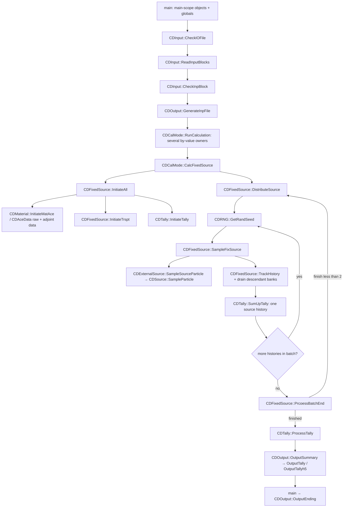

# 当前源码调用图（设计前）

基线：RMC `5cfb0f771d0c5a2127c90d57e51ce672a4e3b616`。下列均为现有函数。



- Main sequence: `RMC/src/main.cpp:123-162`.
- Dispatch / copies: `RMC/src/RunCalculation.cpp:6-23`, `RMC/src/RunCalculation.cpp:83-89`.
- Initialization: `RMC/src/CalcFixedSource.cpp:73-95`, `RMC/src/InitiateAll.cpp:125-209`.
- Neutron batch / history / descendants: `RMC/src/CalcFixedSource.cpp:106-209`.
- Finalization: `RMC/src/CalcFixedSource.cpp:719-749`.
- Batch count and denominator: `RMC/src/InitialBatchSource.cpp:94-144`, `RMC/src/InitialBatchSource.cpp:295-342`.

## Source → transport → tally / WW

```text
SampleFixSource
  → ExternalSource.SampleSourceParticle
    → component probability / weight ratio
    → Source.SampleParticle
      → SampleVariableFromDistri → SampleValue
      → SampleStartPosition / SampleStartDirection
  → LocateParticle / physical energy to MG internal group
TrackHistory
  → RayTracking → native track-mesh WW → DoMeshWeightWindow
    → GetWeightWindowEnergy → setMeshWeightWindowBound → DoWeightWindows
    → TallyByTL → ScoreMeshTallyByTL → p_OMeshTallyData.p_vScore
  → SampleColliNuc → CalcColliNucCs → collision / exit / bank paths
SumUpTally → SumTallyBin → sums and squared history sums
ProcessTally → CalcAveRe → p_OMeshTallyData.p_vAve / p_vRe
```

证据：`RMC/src/SampleNeutronSource.cpp:180-283`；`RMC/src/ExternalSource.cpp:46-57`；`RMC/src/SampleParticle.cpp:24-76`；`RMC/src/TrackHistory.cpp:163-241`；`RMC/src/DoMeshWeightWindow.cpp:21-50`；`RMC/src/ScoreMeshTally.cpp:39-119`；`RMC/src/SumUpTally.cpp:112-132`；`RMC/src/ProcessTally.cpp:364-393`。

图省略不在 v1 范围内的粒子分支；这些分支仍在生产 fixed-source loop 中，不能因 F11 删去或另复制一个 neutron loop。
